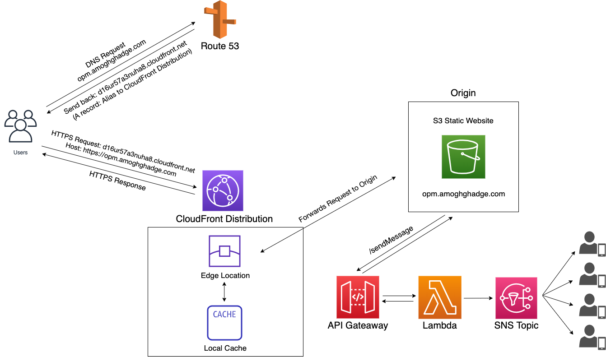

### Introduction
    OPM Alerts is a web application that independent offices can use to convey whether their 
    offices are closed, delayed, or open. The website shows the Operating Status of Federal 
    Offices in the Washington, DC area. This makes it easy for people with independent offices 
    in the DC area to determine whether or not to close, delay, or open, as they can base their 
    judgement off the operating status of the federal offices in DC. 
    
    Then, they can send a text message to people regarding a judgement call on if their office 
    will be closed, delayed, or open. For example, a doctor that runs an office could use this 
    website to message employees as well as patients whether or not the office is closed, 
    delayed, or open.

    The web application is available at opm.amoghghadge.com
___________________________________________________________________________________________________

### Hosting
This source code is packaged and deployed on AWS Lambda. 

The OPM Alerts folder inside of the resources folder in src contains the code for the website, and is uploaded onto an AWS S3 bucket.

___________________________________________________________________________________________________

### Technical Components
   
- Source Code            : Packaged and deployed on AWS Lambda 
- Website                : Uploaded to an S3 bucket 
- API                    : API Gateway invokes the lambda function when the button on the website is pressed 
- Messaging              : AWS SNS is used to send the SMS text message to the phone numbers 
- Application Endpoint   : CloudFront provides an HTTPS endpoint to the backend 
- DNS                    : Route 53 points opm.amoghghadge.com to the CloudFront Distribution 

___________________________________________________________________________________________________

### Architecture

